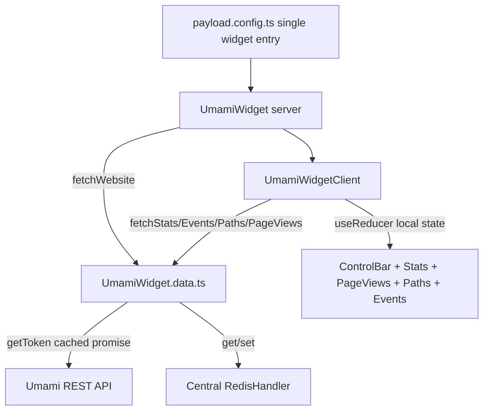

# Requirements

### Overview & Goals
Introduce a new `src/widgets` folder that becomes the home for Payload CMS dashboard widgets, as a peer to `src/components`. As the first widget, consolidate the five separate Umami-related admin components currently under `src/components/AdminPanel/Widgets` (control bar + stats + pageviews + paths + events) into **one single dashboard widget**, and fold the entire data-fetching/auth layer from `src/lib/UmamiHandler.ts` directly into that widget's own module, since the widget becomes its sole consumer. Along the way, the token retrieval/validation logic is optimized to stop getting permanently "stuck" on its first result, while still deduping concurrent in-flight calls the same way it does today.

### Scope
**In Scope**
- New `src/widgets/` folder; first entry `src/widgets/UmamiWidget/` containing the merged widget and its data module.
- One Payload dashboard widget (single `slug`/`widgetSlug`, e.g. `umami-widget`) rendering control bar + stats + pageviews + paths + events together, registered in `payload.config.ts`, replacing the current 5 `widgets`/`defaultLayout` entries.
- Merge of `src/lib/UmamiHandler.ts` (auth token retrieval/validation, `fetchWebsite`/`fetchStats`/`fetchEvents`/`fetchPaths`/`fetchPageViews`, `buildApiUrl`, response-cache helpers, all related types) into a data module co-located with the widget; `src/lib/UmamiHandler.ts` is deleted.
- Response caching (currently `getRedis`/`setCache`/`getCache` duplicating a Redis client bootstrap) is re-pointed to the already-existing central `src/lib/RedisHandler.ts` (`get`/`set`) instead of re-implementing its own client, removing duplicate Redis bootstrap code.
- Per user decision: internal widget state (selected date range, per-section data/loading) managed with local `useState`/`useReducer` inside the merged widget's client component — no context/provider. `src/contexts/UmamiCharts/**` and its registration in `payload.config.ts`'s `admin.components.providers` are removed entirely.
- Per user decision: token caching is optimized into a single cached `getToken()` whose in-flight promise is shared while pending (preserves today's "dedupe concurrent parallel fetches" behavior) and cleared once it settles, so the next call re-verifies/re-logs-in instead of being stuck on the first result forever; the separate `login()`/`verify()` split is removed.
- Deletion of now-superseded files: `src/components/AdminPanel/Widgets/**` (both `UmamiControlBar` and `UmamiWidgets`), `src/lib/UmamiHandler.ts`, `src/contexts/UmamiCharts/**`, and their exports from `src/components/AdminPanel/index.ts`.

**Out of Scope**
- Adding any widget other than the merged Umami widget (task explicitly frames it as "the first widget" in the new folder).
- Changing the Umami REST API contract, displayed metrics, or chart visuals — the merged widget must show the same data as today.
- Changing `next.cache-handler.ts`'s unrelated Next.js `revalidateTag`/`CacheTag` caching (`src/lib/hooks/revalidateResumeSection.ts`, `src/types/cache.ts`).
- Adding automated tests/CI (project has no existing widget test suite to extend).

### User Stories
- As a developer, I want a dedicated `src/widgets` folder so Payload dashboard widgets have a clear, discoverable home separate from generic `src/components`.
- As an admin user, I want to see the same Umami control bar, stats, pageviews chart, paths table, and events table on the dashboard as before, now rendered as one cohesive widget instead of five independently-registered ones.
- As a developer, I want the Umami fetch/auth logic to live next to its only consumer (the widget) instead of a separate `src/lib/UmamiHandler.ts`, so the code is easier to reason about as a single unit.
- As a developer, I want token verification to actually re-check itself over time instead of being frozen on the very first login/verify result for the life of the server process, while still avoiding duplicate concurrent login/verify calls when many widget sections fetch at once.

### Functional Requirements
- The merged widget renders, in order: control bar (website name/link + date-range picker), stats cards, pageviews area chart, paths table, events table — matching current visuals/behavior of each standalone widget.
- Changing the date range via the control bar's date picker triggers refetching of stats/pageviews/paths/events for the new range, same as today.
- `getToken()` (replacing `login`/`verify`) returns a valid bearer token, re-using one shared in-flight promise for concurrent callers, but re-verifying on the next call after a previous check has settled (success or failure).
- `fetchWebsite`/`fetchStats`/`fetchEvents`/`fetchPaths`/`fetchPageViews` behave exactly as before (same URLs, params, response shapes, response caching via `RedisHandler.set`/`RedisHandler.get`).
- `payload.config.ts` dashboard `defaultLayout`/`widgets` arrays contain exactly one Umami entry pointing at the new merged widget component; the old 5 entries are removed.

### Non-Functional Requirements
- No behavior regression for admins: the dashboard must show identical data/interactions after the refactor.
- Follows existing conventions: Payload `WidgetServerProps` server-component + `'use client'` interactive sub-component split (as seen in `UmamiControlBar.tsx`/`UmamiControlBar.client.tsx`), TS path alias `@/*` → `src/*`, and the project's central `RedisHandler` for any Redis access instead of a bespoke client.

# Technical Design

### Current Implementation
- `src/components/AdminPanel/Widgets/UmamiControlBar/` — `UmamiControlBar.tsx` (server, `WidgetServerProps`) calls `fetchWebsite()` and computes min/max date bounds, then renders `UmamiControlBar.client.tsx` (`'use client'`), which reads/writes shared state through `useUmamiCharts()` and shows the website link + a `DatePicker` modal (`@payloadcms/ui`).
- `src/components/AdminPanel/Widgets/UmamiWidgets/` — four separate `'use client'` components (`UmamiStatsWidget`, `UmamiPageViewsWidget`, `UmamiPathsWidget`, `UmamiEventsWidget`), each calling `useUmamiCharts()` for its own slice of data (`stats`/`pageViews`/`paths`/`events`) and calling `registerWidget('stats' | ...)` in a `useEffect` to opt in/out of fetching.
- `src/contexts/UmamiCharts/` (`UmamiChartsContainer.tsx`, `UmamiChartsProvider.tsx`, `UmamiCharts.context.ts`, `UmamiCharts.types.ts`) is an app-wide React Context registered in `payload.config.ts` (`admin.components.providers`). Its reducer holds `selectedInterval`, `website`, and per-section `{ data, dataIsLoading, hasWidget }`; four `useEffect`s fire the actual `fetch*` calls whenever a section `hasWidget` and `selectedInterval` are set. This registration pattern exists purely because today the 5 widgets can be added/removed from the dashboard layout independently.
- `src/lib/UmamiHandler.ts` (`'use server'`) holds: `login()`/`verify()` (each memoizing its **in-flight** promise in a module-level `tokenPromise`/`verifyPromise`, but **never clearing it after it settles** — so after the very first check, `verify()` returns the same cached `true`/`false` forever and `login()` never re-runs even if the token later becomes invalid), `getToken()` (calls `verify()`, then `login()` if not verified), a bespoke `getRedis()`/`setCache()`/`getCache()` (own `createClient()` bootstrap, duplicating what `src/lib/RedisHandler.ts` now provides centrally), `fetcher()` (adds the bearer token, always writes the response into cache — the read-from-cache line is already commented out), `buildApiUrl()`, and the typed `fetchWebsite`/`fetchStats`/`fetchEvents`/`fetchPaths`/`fetchPageViews` functions plus their param/response types.
- `src/lib/RedisHandler.ts` (built earlier in this project) already exposes the canonical `get<T>(key)`/`set<T>(key, value, ttlSeconds?)` cache primitives the app should standardize on, replacing UmamiHandler's own Redis client bootstrap.
- `payload.config.ts` registers each Umami piece individually: `admin.components.providers: ['@/contexts/UmamiCharts#UmamiChartsContainer']`, `admin.dashboard.defaultLayout` (5 entries), and `admin.dashboard.widgets` (5 entries, each `Component: '@/components/AdminPanel#<Widget>'`), re-exported through `src/components/AdminPanel/Widgets/index.ts` → `src/components/AdminPanel/index.ts`.

### Key Decisions
- **Widget state management: local state, no context** (per user decision) — the merged widget owns its own `useReducer`/`useState` inside a single client component tree; `src/contexts/UmamiCharts/**` and its `admin.components.providers` registration are deleted, since only one component tree needs this state once all 5 sections render together.
- **Token caching: single cached `getToken()` promise** (per user decision) — `login`/`verify` collapse into one `getToken()` that caches its in-flight promise only while pending (still dedupes concurrent parallel `fetch*` calls exactly like today), then clears the cache once the promise settles so the next call re-verifies/re-logs-in instead of being frozen on the first result for the process lifetime.
- **Redis access via the central `RedisHandler`** — the widget's data module calls `RedisHandler.get`/`RedisHandler.set` (already implemented in `src/lib/RedisHandler.ts`) instead of re-creating its own `createClient()` bootstrap, removing duplicate Redis client code and TTL logic.
- **Co-location over a shared `lib` file** — all Umami fetch/auth/type code moves into `src/widgets/UmamiWidget/UmamiWidget.data.ts` (server-only, `'use server'`), since the merged widget is now its only caller; `src/lib/UmamiHandler.ts` is deleted rather than kept as a second home for the same logic.

### Proposed Changes
1. Create `src/widgets/UmamiWidget/UmamiWidget.data.ts` (`'use server'`):
   - Port `buildApiUrl`, `Metric`/`AllApiParams` and all `Umami*` types/params from `UmamiHandler.ts` unchanged.
   - Replace `login`/`verify`/`getToken` with a single `getToken()`: caches its in-flight `Promise<string | null>` in a module-level variable while a request is pending (dedupes concurrent callers), clears that variable in a `finally` once the promise settles, and internally still does "verify current token, login if invalid" as one combined flow.
   - Replace `getRedis`/`setCache`/`getCache` call sites with `RedisHandler.get`/`RedisHandler.set` (`@/lib/RedisHandler`); drop the local Redis client bootstrap entirely.
   - Port `fetcher`, `fetchWebsite`, `fetchStats`, `fetchEvents`, `fetchPaths`, `fetchPageViews` unchanged in behavior, only rewired to the new `getToken`/`RedisHandler` calls.
2. Create `src/widgets/UmamiWidget/UmamiWidget.tsx` (server, `WidgetServerProps`):
   - Calls `fetchWebsite()` from the co-located data module (same logic currently in `UmamiControlBar.tsx`) and computes `minDate`/`maxDate`, then renders `UmamiWidget.client.tsx` with those as props.
3. Create `src/widgets/UmamiWidget/UmamiWidget.client.tsx` (`'use client'`):
   - Owns local `useReducer` state equivalent to today's `UmamiChartsState` minus the `hasWidget` registration flags (no longer needed — every section is always mounted together): `selectedInterval`, `website`, and per-section `{ data, dataIsLoading }` for stats/events/paths/pageViews.
   - Runs the same 4 data-fetching `useEffect`s currently in `UmamiChartsProvider`, triggered by `selectedInterval` changes, calling the data module's `fetchStats`/`fetchEvents`/`fetchPaths`/`fetchPageViews`.
   - Persists the selected date range via `usePreferences()` (`@payloadcms/ui`), same `preferencesKey` behavior as today.
   - Renders, in order, the control-bar section (ported from `UmamiControlBar.client.tsx`, date picker modal included), then stats/pageviews/paths/events sections (ported from the four `UmamiWidgets/*` components) as internal subcomponents/functions in the same file or small sibling files, each simply receiving its slice of state as props instead of calling `useUmamiCharts()`.
4. Update `payload.config.ts`:
   - Remove `'@/contexts/UmamiCharts#UmamiChartsContainer'` from `admin.components.providers`.
   - Replace the 5 `defaultLayout`/`widgets` entries with one: `{ widgetSlug: 'umami-widget', width: 'full' }` and `{ slug: 'umami-widget', label: 'Umami', Component: '@/widgets/UmamiWidget#UmamiWidget', minWidth: 'full', maxWidth: 'full' }`.
5. Delete `src/components/AdminPanel/Widgets/**` (both `UmamiControlBar` and `UmamiWidgets`), remove their export from `src/components/AdminPanel/Widgets/index.ts`/`src/components/AdminPanel/index.ts`; delete `src/lib/UmamiHandler.ts`; delete `src/contexts/UmamiCharts/**`.

### Data Models / Contracts
```ts
// src/widgets/UmamiWidget/UmamiWidget.data.ts ('use server')
export const getToken: () => Promise<string | null> // single cached in-flight promise, cleared once settled
export const fetchWebsite: () => Promise<UmamiWebsite | null>
export const fetchStats: (params: UmamiStatsParams) => Promise<UmamiStats | null>
export const fetchEvents: (params: UmamiEventsParams) => Promise<UmamiEvent[] | null>
export const fetchPaths: (params: UmamiPathsParams) => Promise<UmamiPath[] | null>
export const fetchPageViews: (params: UmamiPageViewsParams) => Promise<UmamiPageViews | null>
// UmamiWebsite / UmamiStats / UmamiEvent / UmamiPath / UmamiPageViews types ported as-is from UmamiHandler.ts
```
```ts
// src/widgets/UmamiWidget/UmamiWidget.tsx
export const UmamiWidget: (props: WidgetServerProps) => Promise<JSX.Element>
```
```ts
// src/widgets/UmamiWidget/UmamiWidget.client.tsx
interface UmamiWidgetClientProps {
  startDate: string; endDate: string; minDate: string; maxDate: string
  domain: string | null; id: string | null; name: string | null; teamId: string | null
}
export const UmamiWidgetClient: (props: UmamiWidgetClientProps) => JSX.Element
// internal local state (useReducer): selectedInterval, per-section { data, dataIsLoading }
```

### Components
- **`UmamiWidget`** (new, `src/widgets/UmamiWidget/UmamiWidget.tsx`) — replaces `UmamiControlBar.tsx` as the single Payload dashboard widget server entry point.
- **`UmamiWidgetClient`** (new) — replaces `UmamiControlBar.client.tsx` plus the 4 `UmamiWidgets/*` components; owns local state and renders all 5 sections.
- **`UmamiWidget.data.ts`** (new) — replaces `src/lib/UmamiHandler.ts` entirely.
- **`UmamiChartsProvider`/`UmamiChartsContainer`/`UmamiCharts.context.ts`/`UmamiCharts.types.ts`** (removed) — superseded by local state in `UmamiWidgetClient`.
- **`RedisHandler`** (existing, `src/lib/RedisHandler.ts`) — now also used by the Umami data module for response caching via `get`/`set`, instead of its own client.
- Shared, unmodified building blocks reused as-is: `Card`/`CardHeader`/`CardTitle`/`CardContent`/`CardPagination` (`src/components/AdminPanel/Card`), `MetricsTable`, `Skeleton`, `Icon`, `useArrayPagination`, `Interval` (`src/lib/date/Interval.ts`), `formatSecondsToDuration`.

### File Structure
- `src/widgets/UmamiWidget/UmamiWidget.tsx` — new, merged widget's server entry point.
- `src/widgets/UmamiWidget/UmamiWidget.client.tsx` — new, merged widget's client component + local state + all 5 rendered sections.
- `src/widgets/UmamiWidget/UmamiWidget.data.ts` — new, merged Umami fetch/auth/type module (replaces `UmamiHandler.ts`).
- `src/widgets/UmamiWidget/index.ts` — new, re-exports `UmamiWidget`.
- `payload.config.ts` — modified: single widget registration, provider removed.
- `src/components/AdminPanel/Widgets/**` — deleted.
- `src/lib/UmamiHandler.ts` — deleted.
- `src/contexts/UmamiCharts/**` — deleted.

### Architecture Diagram


### Risks
- Removing the `hasWidget` registration pattern changes fetch timing slightly (all 4 sections now always fetch together instead of only when individually mounted) — acceptable since they are always rendered together in the merged widget, so no functional loss.
- Collapsing `login`/`verify` into one `getToken()` changes the auth flow shape — must preserve the "verify existing token first, log in only if invalid" order so we don't force a fresh login on every call.
- Deleting `src/contexts/UmamiCharts/**` and its `payload.config.ts` provider entry must be done together with the widget replacement in the same step to avoid a dangling provider import.

# Delivery Steps

### ✓ Step 1: Merge Umami fetch/auth logic into a co-located widget data module with optimized token caching
`src/widgets/UmamiWidget/UmamiWidget.data.ts` exists and is the single source of Umami API access, replacing `UmamiHandler.ts`.

- Create `src/widgets/` and `src/widgets/UmamiWidget/UmamiWidget.data.ts` (`'use server'`).
- Port `buildApiUrl`, `Metric`/`AllApiParams`, and all `Umami*` param/response types unchanged from `src/lib/UmamiHandler.ts`.
- Implement `getToken()` replacing `login`/`verify`: caches its in-flight promise in a module-level variable while pending (dedupes concurrent callers, matching today's behavior), clears it in a `finally` once settled, and internally verifies the existing token before logging in again.
- Replace `getRedis`/`setCache`/`getCache` usages with `get`/`set` from the existing `@/lib/RedisHandler`, removing the bespoke Redis client bootstrap.
- Port `fetcher`, `fetchWebsite`, `fetchStats`, `fetchEvents`, `fetchPaths`, `fetchPageViews` with identical URLs/params/response shapes, rewired to `getToken()`/`RedisHandler`.
- Delete `src/lib/UmamiHandler.ts`.

### ✓ Step 2: Build the merged widget's server entry point and local-state client shell
`src/widgets/UmamiWidget/UmamiWidget.tsx` and `UmamiWidget.client.tsx` exist, rendering the control-bar section against local component state (no context).

- Create `src/widgets/UmamiWidget/UmamiWidget.tsx` (`WidgetServerProps`) porting the `fetchWebsite()` + min/max date computation currently in `UmamiControlBar.tsx`.
- Create `src/widgets/UmamiWidget/UmamiWidget.client.tsx` (`'use client'`) with a `useReducer` holding `selectedInterval`, `website`, and per-section `{ data, dataIsLoading }` for stats/events/paths/pageViews (no `hasWidget` flags).
- Port the control-bar UI/behavior from `UmamiControlBar.client.tsx` (website link, `DatePicker` modal, `usePreferences` persistence) to read/write this local state directly.
- Wire the 4 data-fetching `useEffect`s (ported from `UmamiChartsProvider`) to run whenever `selectedInterval` changes, calling the Step 1 data module functions and updating local state.

### ✓ Step 3: Port the stats/pageviews/paths/events sections into the merged widget
The merged widget visually matches today's 5 separate widgets, now as one component tree driven by local state.

- Port `UmamiStatsWidget`, `UmamiPageViewsWidget`, `UmamiPathsWidget`, `UmamiEventsWidget` into internal sections of `UmamiWidget.client.tsx` (same file or small sibling files within `src/widgets/UmamiWidget/`), each receiving its slice of local state as props instead of calling `useUmamiCharts()`.
- Keep existing sub-behavior unchanged: stat cards config/formatting, `MetricsTable` + `useArrayPagination` for paths/events, `AreaChart` rendering for pageviews.
- Create `src/widgets/UmamiWidget/index.ts` re-exporting `UmamiWidget`.

### ✓ Step 4: Register the merged widget and remove superseded code
The Payload dashboard shows exactly one Umami widget; all old Umami widget files/context are gone.

- In `payload.config.ts`, replace the 5 `defaultLayout`/`widgets` Umami entries with a single `umami-widget` entry pointing `Component` at `@/widgets/UmamiWidget#UmamiWidget`.
- Remove `'@/contexts/UmamiCharts#UmamiChartsContainer'` from `admin.components.providers`.
- Delete `src/components/AdminPanel/Widgets/**` (both `UmamiControlBar` and `UmamiWidgets`) and its exports in `src/components/AdminPanel/Widgets/index.ts`/`src/components/AdminPanel/index.ts`.
- Delete `src/contexts/UmamiCharts/**`.
- Verify with `tsc --noEmit` and `biome check` that no remaining references to the deleted modules exist.