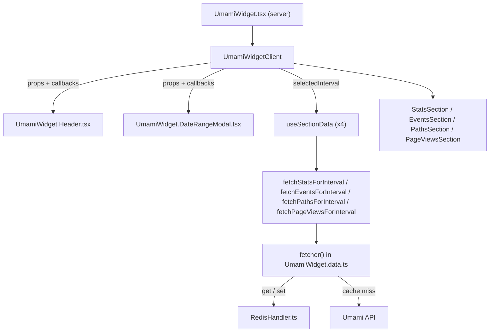

# Requirements

### Overview & Goals
Refactor `src/widgets/UmamiWidget` to be more readable and maintainable, and make the existing Redis caching layer actually reduce calls to the Umami API. No user-visible feature is removed — the widget must look and behave exactly the same after the change.

### Scope
**In Scope**
- Extract the date-range modal content (currently inline JSX inside `UmamiWidget.client.tsx`) into its own component file, following the existing `UmamiWidget.<Name>.tsx` convention used by `UmamiWidget.StatsSection.tsx` / `.EventsSection.tsx` / `.PathsSection.tsx` / `.PageViewsSection.tsx`.
- Extract the header/control bar (title + link, prev/next buttons, date-range button) into its own component file.
- Replace the single `useReducer` (8 action types) and 4 duplicated `useEffect` fetch blocks in `UmamiWidget.client.tsx` with one small reusable hook (`useSectionData`), called once per data section (stats/events/paths/pageViews).
- Fix `fetcher` in `UmamiWidget.data.ts` so it actually reads from Redis (`get`) before calling the Umami API, instead of only writing (`set`) after every call — the cache is currently write-only and never short-circuits a request.
- Collapse the 6 near-duplicate "quick select" buttons in the date-range modal (Today / This Week / Last 30 Days / This Month / Last 90 Days / This Year / Last 12 Months) into a config-driven list rendered with `.map()`, mirroring the `CONFIG` pattern already used in `UmamiWidget.StatsSection.tsx`.

**Out of Scope**
- Changing the visual design, layout, or CSS classes of the widget.
- Changing the Umami API endpoints or params being requested (`UmamiWidget.data.ts` fetch functions keep their exact signatures/behavior).
- Adding new features (e.g. persisting the selected date range via `getPreferences`/`setPreferences` — the currently unused `preferencesKey` constant is dead code and is simply removed, not wired up).
- Changing `RedisHandler.ts` beyond what's already fixed in the prior session (client init/typing).
- Adding an automated test suite (none exists for this widget today).

### User Stories
- As a developer maintaining the widget, I want the header, the date-range modal, and the async data-loading logic split into small, single-purpose files so I can find and change one concern without reading 585 lines of mixed JSX and state logic.
- As an admin using the dashboard, I want repeated navigation through the same date range to load instantly from cache instead of re-hitting the Umami API every time, without noticing any change in behavior.

### Functional Requirements
- The widget renders identically: title/link, prev/next range buttons, the date-range button opening a `FullscreenModal`, quick-select buttons, two `DatePicker`s, Cancel/Apply footer, and the four data sections below.
- Selecting a quick-range button or confirming custom start/end dates in the modal updates the displayed data exactly as before.
- Prev/next buttons still shift the interval by its own duration, wrapped in `startTransition` as today.
- Each of the four sections (`stats`, `events`, `paths`, `pageViews`) still independently tracks its own `data` and `dataIsLoading` state and re-fetches whenever `selectedInterval` changes.
- Repeated requests for the same Umami query (same URL/params) within the cache TTL are served from Redis instead of calling the Umami API again.

# Technical Design

### Current Implementation
- `UmamiWidget.client.tsx` (585 lines): one `useReducer` with 8 action types (`SET_SELECTED_TIME_SPAN`, `SET_{STATS,EVENTS,PATHS,PAGE_VIEWS}_{DATA,LOADING}`), 4 nearly-identical `useEffect` blocks (set loading → fetch → set data → unset loading), plus ~180 lines of inline JSX for the header and the `FullscreenModal` date-range picker content.
- `UmamiWidget.types.ts` (91 lines): only defines the reducer's `UmamiWidgetState`/`UmamiWidgetAction`/`initialUmamiWidgetState`, used exclusively by `UmamiWidget.client.tsx` (confirmed via project-wide search — no other consumers).
- `UmamiWidget.data.ts`: `fetcher()` calls `set(url.toString(), json, CACHE_TTL_SECONDS)` after every successful response but never calls `get()` first — the Redis cache is write-only today and never actually prevents a request.
- `RedisHandler.ts` (already fixed this session): exports `get`/`set`/`invalidate`/`publish`/`subscribe`/`unsubscribe`/`getClient`, with promise-deduped lazy client init. No further changes needed here.
- Section components (`UmamiWidget.StatsSection.tsx` etc.) already establish the target conventions: one file per concern, `data`/`dataIsLoading`/`className` props, and a `CONFIG` object driving repetitive rendering (see `StatsSection`'s `CONFIG` map for icon/title/order/format).

### Key Decisions
1. **State management: custom `useSectionData` hook per section** (confirmed with user). Removes the reducer and `UmamiWidget.types.ts` entirely; each section's data/loading becomes local `useState` inside a tiny reusable hook, called 4 times instead of writing 4 duplicated effects. The hook also adds a stale-response guard (ignore a fetch's result if the interval changed again before it resolved) — a real correctness improvement, not just a readability one, and it changes no visible behavior.
2. **Redis cache: flat 2-hour TTL for all ranges** (confirmed with user). No conditional/shorter TTL for "today"-inclusive ranges; keep using the existing `CACHE_TTL_SECONDS = hoursToSeconds(2)` constant for every cached response.
3. **Cache-aside read**: `fetcher` will call `get<T>(cacheKey)` first; on a hit, return the cached value immediately without calling `fetch()`; on a miss, fetch, then `set()` as today. Cache key stays the full request URL (already unique per endpoint+params), so no key-format change is needed.
4. **`selectedInterval` becomes a plain `useState`** (not part of any reducer) since it's a single independent value with one setter, decoupled from the four per-section hooks.
5. Quick-select buttons in the date-range modal become data-driven (`{ label, apply }[]` mapped over `Interval` factory methods) instead of 6 copy-pasted `<Button>` blocks, following the `CONFIG`-object precedent from `StatsSection`.

### Proposed Changes
- **`UmamiWidget.hooks.ts` (new)**: exports `useSectionData<T>(selectedInterval, fetchFn)` returning `{ data, isLoading }`. Internally: `useState<T|null>(null)`, `useState(false)`, and a `useEffect` keyed on `[selectedInterval, fetchFn]` that sets loading, calls `fetchFn(selectedInterval)`, sets data on resolve (if not stale), and clears loading in `finally` (if not stale) via a cleanup-set `isCancelled` flag.
- **`UmamiWidget.data.ts`**: add 4 module-level adapter functions (`fetchStatsForInterval`, `fetchEventsForInterval`, `fetchPathsForInterval`, `fetchPageViewsForInterval`) that close over the fixed extra params (`unit: 'day'`, `timezone: 'Europe/Berlin'`) so they have stable references across renders and can be passed straight into `useSectionData`. Fix `fetcher` to check `get()` before `fetch()`.
- **`UmamiWidget.Header.tsx` (new)**: the title/link block + prev/next `ButtonGroup` + date-range display `Button` that opens the modal. Props: `domain`, `name`, `umamiUrl`, `startDate`, `endDate`, `onOpenModal`, `onMoveInterval(direction: 1 | -1)`. Keeps the existing `Skeleton` loading fallback when `!domain && !name`.
- **`UmamiWidget.DateRangeModal.tsx` (new)**: the `FullscreenModal` content — quick-select button list (config-driven), the two `DatePicker`s, and the Cancel/Apply footer. Props: `tempStartDate`, `tempEndDate`, `setTempStartDate`, `setTempEndDate`, `minDate`, `maxDate`, `startDate`, `endDate`, `onQuickSelect(interval)`, `onCancel`, `onConfirm`. Keeps the existing scoped `<style>` block for the date picker overrides.
- **`UmamiWidget.client.tsx`**: shrinks to orchestration — `useState` for `selectedInterval`/`tempStartDate`/`tempEndDate`, 4 `useSectionData` calls, `useModal` handlers, and rendering `<Header>` + `<DateRangeModal>` + the 4 existing `<XSection>` components unchanged.
- **`UmamiWidget.types.ts`**: removed (no longer needed — its only consumer is being removed). If a small shared type is still useful for section props, it can live inline in `UmamiWidget.hooks.ts`.
- Remove the unused `preferencesKey` constant (dead code, not wired to any behavior today).

### Data Models / Contracts
```ts
// UmamiWidget.hooks.ts
export function useSectionData<T>(
  selectedInterval: Interval | null,
  fetchFn: (interval: Interval) => Promise<T | null>,
): { data: T | null; isLoading: boolean }

// UmamiWidget.data.ts — fetcher becomes cache-aside
const fetcher = async <T extends object>(url: URL | string): Promise<T | null> => {
  const cached = await get<T>(url.toString())
  if (cached) return cached

  const token = await getToken()
  const response = await fetch(url, { headers: { Accept: 'application/json', Authorization: `Bearer ${token}` } })
  const json: T = await response.json()
  if ('error' in json) return null

  await set(url.toString(), json, CACHE_TTL_SECONDS)
  return json
}
```

### Components
- `UmamiWidgetClient` (modified) — orchestrator only; no more reducer, no more inline modal/header JSX.
- `Header` (new, `UmamiWidget.Header.tsx`) — title/link + navigation controls.
- `DateRangeModal` (new, `UmamiWidget.DateRangeModal.tsx`) — modal body, quick-select list, dual date pickers, footer.
- `StatsSection` / `EventsSection` / `PathsSection` / `PageViewsSection` — unchanged, still receive `data`/`dataIsLoading`/`className` exactly as today, now sourced from `useSectionData` instead of the reducer.

### File Structure
```
src/widgets/UmamiWidget/
├── UmamiWidget.tsx                 (unchanged)
├── UmamiWidget.client.tsx          (simplified — orchestration only)
├── UmamiWidget.Header.tsx          (new)
├── UmamiWidget.DateRangeModal.tsx  (new)
├── UmamiWidget.hooks.ts            (new — useSectionData)
├── UmamiWidget.data.ts             (modified — cache-aside fetcher + adapters)
├── UmamiWidget.types.ts            (removed)
├── UmamiWidget.StatsSection.tsx    (unchanged)
├── UmamiWidget.EventsSection.tsx   (unchanged)
├── UmamiWidget.PathsSection.tsx    (unchanged)
├── UmamiWidget.PageViewsSection.tsx(unchanged)
└── index.ts                        (unchanged)
```

### Architecture Diagram


### Risks
- **Stale-response guard behavior change**: adding the `isCancelled` guard in `useSectionData` means a very fast interval change could now leave the previous "data" visible slightly longer (until the new fetch resolves) instead of briefly flashing an old response — this is a bug fix, not a regression, but worth noting since it's a subtle behavior difference from today's reducer (which had no such guard).
- **Adapter function stability**: the 4 `fetchXForInterval` wrappers must be defined at module scope (not inside the component) so their references stay stable across renders and don't retrigger `useSectionData`'s effect unnecessarily.
- **Cache correctness**: enabling cache reads means any bug in TTL or key derivation now visibly affects the UI (stale data shown) instead of silently doing nothing; mitigated by keeping the existing, already-unique-per-query URL as the cache key and the existing TTL constant unchanged.

# Delivery Steps

### ✓ Step 1: Extract Header and DateRangeModal components
The header controls and the date-range modal body are moved out of `UmamiWidget.client.tsx` into their own files, with `UmamiWidget.client.tsx` rendering them via props/callbacks instead of inline JSX.

- Create `UmamiWidget.Header.tsx`: title/link block, `Skeleton` loading fallback, prev/next `ButtonGroup`, and the date-range display `Button`; accepts `domain`, `name`, `umamiUrl`, `startDate`, `endDate`, `onOpenModal`, `onMoveInterval` props.
- Create `UmamiWidget.DateRangeModal.tsx`: the `FullscreenModal` content, including the scoped `<style>` override block, the two `DatePicker`s, and the Cancel/Apply footer; accepts `tempStartDate`, `tempEndDate`, `setTempStartDate`, `setTempEndDate`, `minDate`, `maxDate`, `startDate`, `endDate`, `onCancel`, `onConfirm` props.
- Collapse the 6 quick-select buttons (Today, This Week, Last 30 Days, This Month, Last 90 Days, This Year, Last 12 Months) into a config array of `{ label, apply: (interval: Interval) => Interval }` rendered with `.map()` inside `UmamiWidget.DateRangeModal.tsx`, mirroring the `CONFIG` pattern in `UmamiWidget.StatsSection.tsx`.
- Update `UmamiWidget.client.tsx` to import and render `<Header>` and `<DateRangeModal>` in place of the removed inline JSX, wiring the existing `handleModalOpen`/`handleConfirm`/`handleCancel` callbacks and `tempStartDate`/`tempEndDate` state through as props.
- Remove the unused `preferencesKey` dead-code constant from `UmamiWidget.client.tsx`.

### ✓ Step 2: Replace reducer with useSectionData hook
`UmamiWidget.client.tsx` no longer uses `useReducer`; each of the four data sections is driven by a small reusable `useSectionData` hook, and `UmamiWidget.types.ts` is removed.

- Create `UmamiWidget.hooks.ts` exporting `useSectionData<T>(selectedInterval, fetchFn)`, which manages `data`/`isLoading` via `useState` and includes a stale-response guard (ignore a resolved fetch if the interval changed again in the meantime).
- In `UmamiWidget.data.ts`, add module-level adapter functions `fetchStatsForInterval`, `fetchEventsForInterval`, `fetchPathsForInterval`, `fetchPageViewsForInterval` that close over the fixed extra params (`unit: 'day'`, `timezone: 'Europe/Berlin'`) so each has a stable reference for `useSectionData`.
- In `UmamiWidget.client.tsx`, replace the `useReducer`/reducer function and the 4 duplicated `useEffect` blocks with 4 `useSectionData` calls (one per section), and convert `selectedInterval` into a plain `useState`.
- Delete `UmamiWidget.types.ts` and remove its imports from `UmamiWidget.client.tsx`.
- Verify `StatsSection`/`EventsSection`/`PathsSection`/`PageViewsSection` still receive the same `data`/`dataIsLoading`/`className` props as before, unchanged.

### ✓ Step 3: Enable Redis cache-aside reads in the Umami fetcher
Repeated Umami queries for the same URL/params within the TTL window are served from Redis instead of re-calling the Umami API.

- In `UmamiWidget.data.ts`, update `fetcher` to call `get<T>(url.toString())` from `@/lib/RedisHandler` before making the network request; return the cached value immediately on a hit.
- On a cache miss, keep the existing flow: fetch from Umami, validate the response, `set()` the result with the existing `CACHE_TTL_SECONDS` (flat 2-hour TTL for all ranges, per confirmed decision), and return it.
- Keep the cache key as the full request URL (already unique per endpoint and params) — no change to `buildApiUrl` or key derivation.
- Confirm `fetchWebsite` (used by the server component `UmamiWidget.tsx`) benefits automatically since it goes through the same shared `fetcher`.

### ✓ Step 4: Validate refactor with type-check and lint
The refactored widget compiles cleanly and preserves all current behavior with no lint/type regressions.

- Run `tsc --noEmit` and confirm no new errors are introduced in `src/widgets/UmamiWidget/**` or `src/lib/RedisHandler.ts`.
- Run `biome check` on all changed/added files (`UmamiWidget.client.tsx`, `UmamiWidget.Header.tsx`, `UmamiWidget.DateRangeModal.tsx`, `UmamiWidget.hooks.ts`, `UmamiWidget.data.ts`) and fix any reported issues.
- Manually trace through each user flow against the Requirements tab (quick-select, custom range via date pickers, prev/next navigation, per-section loading states) to confirm no behavior changed.